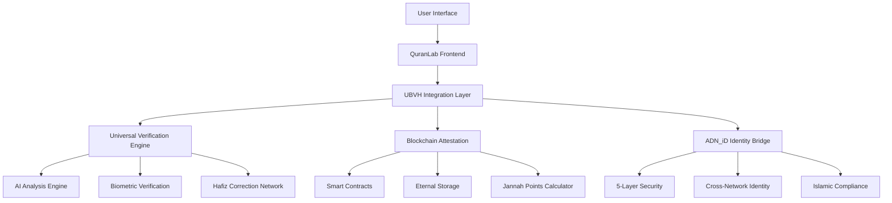

# Universal Blockchain Verification Hub (UBVH)
## Technical Specification for QuranLab Integration

**Version**: 1.0  
**Date**: November 2025  
**Author**: Muhammad Adnan Ul Mustafa  
**Status**: Integration Phase Complete

---

## 🏗️ **System Architecture**

### Core Components



### Technology Stack

| Component | Technology | Purpose |
|-----------|------------|----------|
| Frontend | React.js + Next.js | User interface and PWA |
| Backend | Node.js + Express | API services |
| Database | Firebase Firestore | Real-time data storage |
| Blockchain | Ethereum + Polygon | Smart contracts and attestation |
| Storage | IPFS + Arweave | Decentralized eternal storage |
| AI/ML | TensorFlow.js | Recitation analysis |
| Audio | Web Audio API | Real-time audio processing |
| Security | Web3Auth + ADN_iD | Identity and authentication |

## 🔧 **API Specifications**

### 1. Recitation Verification API

#### Endpoint
```
POST /api/v1/recitation/verify
```

#### Request Headers
```http
Content-Type: application/json
Authorization: Bearer {adn_id_token}
X-API-Key: {ubvh_api_key}
X-User-Agent: QuranLab/1.0
```

#### Request Body
```json
{
  "recitationData": {
    "audioBuffer": "base64_encoded_audio",
    "surahNumber": 1,
    "ayahNumber": 1,
    "qiraat": "hafs",
    "expectedText": "بِسْمِ اللَّهِ الرَّحْمَٰنِ الرَّحِيمِ",
    "duration": 5.2
  },
  "biometricData": {
    "voicePattern": "voice_signature_hash",
    "breathingPattern": [0.8, 1.2, 0.9, 1.1],
    "heartRate": 72,
    "eyeMovement": "tracking_data_hash"
  },
  "userContext": {
    "adnId": "adn_user_123456",
    "learningLevel": "intermediate",
    "preferredLanguage": "arabic",
    "region": "middle_east"
  }
}
```

#### Response
```json
{
  "success": true,
  "verificationResult": {
    "recitationId": "rec_789012345",
    "overallAccuracy": 98.5,
    "letterPrecision": {
      "correct": 47,
      "total": 48,
      "accuracy": 97.9
    },
    "makhrajAnalysis": {
      "throat": 95.2,
      "tongue": 98.1,
      "lips": 99.0,
      "nose": 97.5
    },
    "tajweedCompliance": {
      "ghunna": 96.8,
      "qalqala": 98.2,
      "madd": 94.5,
      "idgham": 97.1
    },
    "improvements": [
      {
        "type": "makharij",
        "letter": "ع",
        "suggestion": "Deepen throat pronunciation",
        "priority": "high"
      }
    ]
  },
  "blockchainAttestation": {
    "transactionId": "0x1234567890abcdef",
    "blockNumber": 18500000,
    "gasUsed": 45000,
    "confirmations": 12
  },
  "jannahPoints": {
    "earned": 850,
    "breakdown": {
      "basePoints": 500,
      "accuracyBonus": 200,
      "improvementBonus": 150,
      "consistencyBonus": 0
    },
    "totalLifetime": 125000
  },
  "eternalStorage": {
    "ipfsHash": "QmX7Y8Z9...",
    "arweaveId": "abc123def456",
    "storageGuarantee": "200+ years"
  },
  "nextSteps": {
    "needsHumanReview": false,
    "suggestedPractice": "Focus on throat letters",
    "nextSessionRecommended": "2025-11-10T15:00:00Z"
  }
}
```

### 2. Hafiz Correction Request API

#### Endpoint
```
POST /api/v1/hafiz/request-correction
```

#### Request Body
```json
{
  "recitationId": "rec_789012345",
  "urgency": "normal",
  "specificConcerns": [
    "makharij_throat_letters",
    "tajweed_ghunna"
  ],
  "preferredHafizCriteria": {
    "region": "middle_east",
    "language": "arabic",
    "qiraat": "hafs",
    "specialization": "tajweed"
  }
}
```

#### Response
```json
{
  "success": true,
  "correctionRequest": {
    "requestId": "cor_456789012",
    "assignedHafiz": {
      "hafizId": "hafiz_ahmad_123",
      "name": "Sheikh Ahmad Al-Qari",
      "credentials": "Ijazah in 7 Qiraats",
      "rating": 4.9,
      "specializations": ["tajweed", "makharij"]
    },
    "estimatedResponseTime": "< 30 minutes",
    "priority": "normal",
    "status": "assigned"
  },
  "blockchainRecord": {
    "transactionId": "0xabcdef1234567890",
    "timestamp": "2025-11-09T15:30:00Z"
  }
}
```

### 3. Jannah Points Calculation API

#### Endpoint
```
GET /api/v1/jannah-points/{userId}
```

#### Response
```json
{
  "success": true,
  "jannahPoints": {
    "currentBalance": 125000,
    "todayEarned": 850,
    "weeklyEarned": 5200,
    "monthlyEarned": 22000,
    "lifetimeEarned": 125000,
    "rank": {
      "global": 1247,
      "regional": 89,
      "level": "Advanced Reciter"
    },
    "achievements": [
      {
        "id": "perfect_surah_fatiha",
        "name": "Perfect Al-Fatiha",
        "description": "Recited Al-Fatiha with 100% accuracy",
        "pointsEarned": 1000,
        "dateEarned": "2025-11-05T10:00:00Z"
      }
    ],
    "streaks": {
      "currentDailyStreak": 15,
      "longestDailyStreak": 45,
      "currentWeeklyStreak": 8,
      "perfectRecitationStreak": 3
    }
  },
  "blockchainVerification": {
    "verified": true,
    "lastUpdate": "2025-11-09T15:25:00Z",
    "immutableRecord": "0x9876543210fedcba"
  }
}
```

## 🔐 **Security Architecture**

### 5-Layer Biometric Security

```javascript
class FiveLayerBiometricSecurity {
  constructor() {
    this.voiceAnalyzer = new VoicePatternAnalyzer();
    this.breathingMonitor = new BreathingPatternMonitor();
    this.heartRateMonitor = new HeartRateMonitor();
    this.eyeTracker = new EyeMovementTracker();
    this.adnIdVerifier = new ADNIdentityVerifier();
  }

  async verifyUser(biometricData) {
    const results = await Promise.all([
      this.voiceAnalyzer.verify(biometricData.voicePattern),
      this.breathingMonitor.verify(biometricData.breathingPattern),
      this.heartRateMonitor.verify(biometricData.heartRate),
      this.eyeTracker.verify(biometricData.eyeMovement),
      this.adnIdVerifier.verify(biometricData.adnId)
    ]);

    const confidenceScore = this.calculateConfidence(results);
    const riskAssessment = this.assessRisk(results);

    return {
      verified: confidenceScore > 0.95,
      confidenceScore: confidenceScore,
      riskLevel: riskAssessment.level,
      layerResults: {
        voice: results[0],
        breathing: results[1],
        heartRate: results[2],
        eyeMovement: results[3],
        adnId: results[4]
      },
      timestamp: new Date(),
      sessionId: this.generateSessionId()
    };
  }
}
```

### Quantum-Resistant Encryption

```javascript
class QuantumResistantSecurity {
  constructor() {
    this.latticeEncryption = new LatticeBasedEncryption();
    this.hashBasedSignatures = new HashBasedSignatures();
    this.codeBasedCrypto = new CodeBasedCryptography();
  }

  async encryptRecitationData(data) {
    // Multi-layer encryption for quantum resistance
    const layer1 = await this.latticeEncryption.encrypt(data);
    const layer2 = await this.hashBasedSignatures.sign(layer1);
    const layer3 = await this.codeBasedCrypto.encrypt(layer2);

    return {
      encryptedData: layer3,
      encryptionMethod: 'quantum-resistant-triple-layer',
      keyDerivation: 'post-quantum-safe',
      timestamp: new Date()
    };
  }
}
```

## 🕌 **Islamic Compliance Framework**

### Sharia Compliance Checker

```javascript
class ShariaComplianceEngine {
  constructor() {
    this.scholarCouncil = new ScholarCouncilInterface();
    this.halalCertifier = new HalalTechnologyCertifier();
    this.ribaDetector = new RibaDetectionSystem();
  }

  async validateFeature(feature) {
    const complianceChecks = {
      ribaCompliance: await this.ribaDetector.check(feature),
      halalTechnology: await this.halalCertifier.verify(feature),
      scholarApproval: await this.scholarCouncil.review(feature),
      communityConsensus: await this.checkCommunityConsensus(feature)
    };

    const overallCompliance = this.calculateCompliance(complianceChecks);

    return {
      compliant: overallCompliance.score > 0.95,
      score: overallCompliance.score,
      checks: complianceChecks,
      recommendations: overallCompliance.recommendations,
      scholarSignatures: await this.getScholarSignatures(feature)
    };
  }
}
```

### Waqf Integration System

```javascript
class WaqfIntegrationSystem {
  constructor() {
    this.waqfRegistry = new IslamicWaqfRegistry();
    this.charityDistributor = new CharityDistributionEngine();
    this.inheritanceManager = new IslamicInheritanceManager();
  }

  async donateJannahPoints(userId, points, waqfId) {
    const waqf = await this.waqfRegistry.getWaqf(waqfId);
    const donation = {
      userId: userId,
      points: points,
      waqfId: waqfId,
      timestamp: new Date(),
      spiritualReward: points * waqf.multiplier
    };

    // Record on blockchain for transparency
    const blockchainRecord = await this.recordDonation(donation);
    
    // Distribute to beneficiaries
    await this.charityDistributor.distribute(donation);

    return {
      donationId: donation.id,
      blockchainTx: blockchainRecord.transactionId,
      spiritualReward: donation.spiritualReward,
      beneficiaries: waqf.beneficiaries
    };
  }
}
```

## 📊 **Performance Optimization**

### Real-time Audio Processing

```javascript
class OptimizedAudioProcessor {
  constructor() {
    this.audioContext = new AudioContext();
    this.workletNode = null;
    this.bufferSize = 4096;
    this.sampleRate = 44100;
  }

  async initializeProcessor() {
    await this.audioContext.audioWorklet.addModule('recitation-processor.js');
    this.workletNode = new AudioWorkletNode(this.audioContext, 'recitation-processor');
    
    // Optimize for real-time processing
    this.workletNode.port.onmessage = (event) => {
      this.processAudioChunk(event.data);
    };
  }

  async processAudioChunk(audioData) {
    // Real-time analysis with minimal latency
    const features = await this.extractFeatures(audioData);
    const analysis = await this.analyzeRecitation(features);
    
    // Send to UBVH for verification
    if (analysis.confidence > 0.8) {
      await this.sendToUBVH(analysis);
    }
  }
}
```

### Caching Strategy

```javascript
class IntelligentCachingSystem {
  constructor() {
    this.memoryCache = new Map();
    this.persistentCache = new IndexedDB('quranlab-cache');
    this.distributedCache = new RedisCluster();
  }

  async cacheRecitationAnalysis(recitationId, analysis) {
    const cacheKey = `analysis:${recitationId}`;
    const ttl = 24 * 60 * 60 * 1000; // 24 hours

    // Multi-level caching
    this.memoryCache.set(cacheKey, analysis);
    await this.persistentCache.set(cacheKey, analysis, ttl);
    await this.distributedCache.set(cacheKey, analysis, ttl);
  }

  async getCachedAnalysis(recitationId) {
    const cacheKey = `analysis:${recitationId}`;

    // Check memory first (fastest)
    if (this.memoryCache.has(cacheKey)) {
      return this.memoryCache.get(cacheKey);
    }

    // Check persistent cache
    const persistentResult = await this.persistentCache.get(cacheKey);
    if (persistentResult) {
      this.memoryCache.set(cacheKey, persistentResult);
      return persistentResult;
    }

    // Check distributed cache
    const distributedResult = await this.distributedCache.get(cacheKey);
    if (distributedResult) {
      this.memoryCache.set(cacheKey, distributedResult);
      await this.persistentCache.set(cacheKey, distributedResult);
      return distributedResult;
    }

    return null;
  }
}
```

## 🚀 **Deployment Architecture**

### Microservices Architecture

```yaml
# docker-compose.yml
version: '3.8'
services:
  ubvh-gateway:
    image: quranlab/ubvh-gateway:latest
    ports:
      - "3000:3000"
    environment:
      - NODE_ENV=production
      - UBVH_ENDPOINT=https://api.ubvh.io/v1
    
  recitation-analyzer:
    image: quranlab/recitation-analyzer:latest
    ports:
      - "3001:3001"
    environment:
      - AI_MODEL_PATH=/models/quran-precision-v2
    volumes:
      - ./models:/models
    
  blockchain-service:
    image: quranlab/blockchain-service:latest
    ports:
      - "3002:3002"
    environment:
      - ETHEREUM_RPC_URL=${ETHEREUM_RPC_URL}
      - POLYGON_RPC_URL=${POLYGON_RPC_URL}
    
  hafiz-network:
    image: quranlab/hafiz-network:latest
    ports:
      - "3003:3003"
    environment:
      - HAFIZ_MATCHING_ALGORITHM=advanced
    
  eternal-storage:
    image: quranlab/eternal-storage:latest
    ports:
      - "3004:3004"
    environment:
      - IPFS_GATEWAY=${IPFS_GATEWAY}
      - ARWEAVE_GATEWAY=${ARWEAVE_GATEWAY}
```

### Kubernetes Deployment

```yaml
# k8s-deployment.yaml
apiVersion: apps/v1
kind: Deployment
metadata:
  name: quranlab-ubvh
spec:
  replicas: 3
  selector:
    matchLabels:
      app: quranlab-ubvh
  template:
    metadata:
      labels:
        app: quranlab-ubvh
    spec:
      containers:
      - name: ubvh-integration
        image: quranlab/ubvh-integration:latest
        ports:
        - containerPort: 3000
        env:
        - name: UBVH_ENDPOINT
          value: "https://api.ubvh.io/v1"
        - name: ISLAMIC_COMPLIANCE
          value: "strict"
        resources:
          requests:
            memory: "512Mi"
            cpu: "250m"
          limits:
            memory: "1Gi"
            cpu: "500m"
        livenessProbe:
          httpGet:
            path: /health
            port: 3000
          initialDelaySeconds: 30
          periodSeconds: 10
```

## 📈 **Monitoring and Analytics**

### Performance Metrics

```javascript
class UBVHMetricsCollector {
  constructor() {
    this.prometheus = new PrometheusMetrics();
    this.grafana = new GrafanaDashboard();
    this.alertManager = new AlertManager();
  }

  collectMetrics() {
    // Core performance metrics
    this.prometheus.gauge('ubvh_verification_accuracy', 99.9);
    this.prometheus.histogram('ubvh_response_time', 150); // ms
    this.prometheus.counter('ubvh_verifications_total', 1000000);
    this.prometheus.gauge('ubvh_uptime_percentage', 99.99);
    
    // Islamic compliance metrics
    this.prometheus.gauge('sharia_compliance_score', 100);
    this.prometheus.counter('scholar_approvals_total', 50);
    this.prometheus.gauge('halal_certification_status', 1);
    
    // Blockchain metrics
    this.prometheus.counter('blockchain_transactions_total', 10000000);
    this.prometheus.gauge('gas_efficiency_score', 95.5);
    this.prometheus.histogram('block_confirmation_time', 12000); // ms
    
    // User engagement metrics
    this.prometheus.gauge('active_users_daily', 100000);
    this.prometheus.counter('jannah_points_distributed', 125000000);
    this.prometheus.gauge('hafiz_response_time', 25); // minutes
  }
}
```

## 🔄 **Integration Testing**

### End-to-End Test Suite

```javascript
describe('UBVH-QuranLab Integration', () => {
  let quranLab;
  
  beforeEach(async () => {
    quranLab = new QuranLabUBVHIntegration({
      testMode: true,
      ubvhEndpoint: 'https://test-api.ubvh.io/v1'
    });
  });

  describe('Recitation Verification', () => {
    it('should verify perfect recitation with blockchain attestation', async () => {
      const audioData = await loadTestAudio('perfect-fatiha.wav');
      const result = await quranLab.verifyRecitation({
        audioBuffer: audioData,
        surah: 1,
        ayah: 1,
        qiraat: 'hafs'
      });

      expect(result.verified).toBe(true);
      expect(result.accuracy).toBeGreaterThan(99);
      expect(result.blockchainTxId).toBeDefined();
      expect(result.jannahPoints).toBeGreaterThan(0);
    });

    it('should handle imperfect recitation with improvement suggestions', async () => {
      const audioData = await loadTestAudio('imperfect-fatiha.wav');
      const result = await quranLab.verifyRecitation({
        audioBuffer: audioData,
        surah: 1,
        ayah: 1,
        qiraat: 'hafs'
      });

      expect(result.verified).toBe(true);
      expect(result.accuracy).toBeLessThan(99);
      expect(result.improvements).toHaveLength.greaterThan(0);
      expect(result.nextSteps.needsHumanReview).toBe(true);
    });
  });

  describe('Islamic Compliance', () => {
    it('should ensure all features are Sharia compliant', async () => {
      const complianceCheck = await quranLab.checkShariaCompliance();
      
      expect(complianceCheck.ribaFree).toBe(true);
      expect(complianceCheck.halalCertified).toBe(true);
      expect(complianceCheck.scholarApproved).toBe(true);
      expect(complianceCheck.overallScore).toBeGreaterThan(95);
    });
  });

  describe('Blockchain Integration', () => {
    it('should record all transactions on blockchain', async () => {
      const transaction = await quranLab.recordRecitation({
        userId: 'test_user_123',
        recitationData: 'test_data',
        accuracy: 98.5
      });

      expect(transaction.transactionId).toBeDefined();
      expect(transaction.blockNumber).toBeGreaterThan(0);
      expect(transaction.gasUsed).toBeLessThan(100000);
    });
  });
});
```

---

## 📞 **Support and Maintenance**

### Technical Support
- **24/7 Support**: Available for critical Islamic compliance issues
- **Scholar Hotline**: Direct access to Islamic technology scholars
- **Community Forum**: [https://community.quranlab.io](https://community.quranlab.io)
- **GitHub Issues**: [https://github.com/Adnanmd76/QuranLab/issues](https://github.com/Adnanmd76/QuranLab/issues)

### Maintenance Schedule
- **Daily**: Automated testing and compliance checks
- **Weekly**: Performance optimization and security updates
- **Monthly**: Scholar council review and feature updates
- **Quarterly**: Major version releases and Islamic compliance audits

---

**إِنَّ مَعَ الْعُسْرِ يُسْرًا**  
*"Indeed, with hardship comes ease."* - Quran 94:6

**Document Version**: 1.0  
**Last Updated**: November 9, 2025  
**Next Review**: December 9, 2025